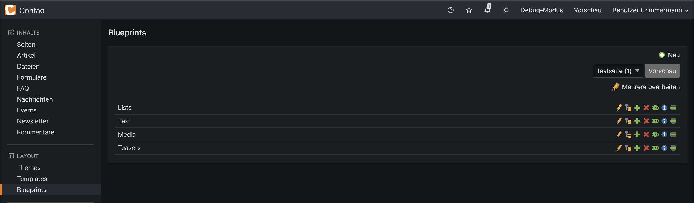
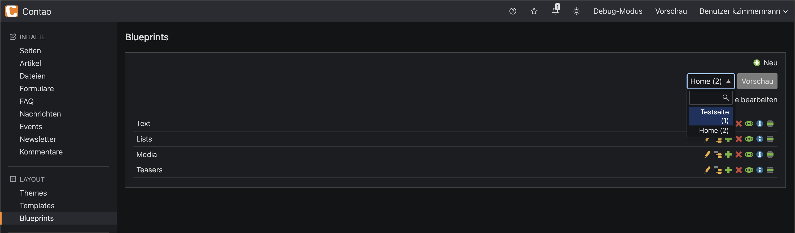
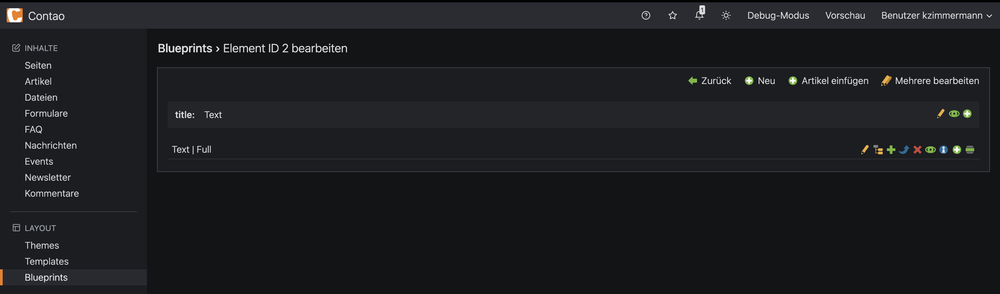
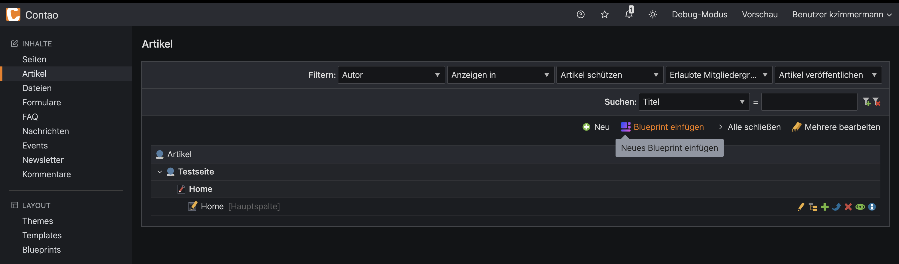
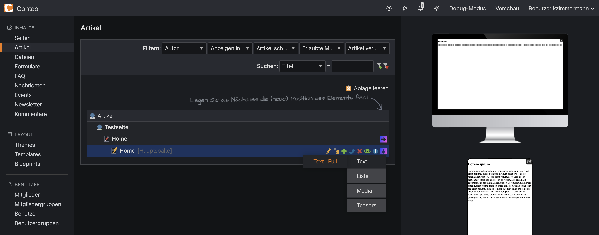

# KIWI. Contao Blueprints
This bundle enhaces the UX of your backend editors by enabling you to store reusable article-templates (blueprints) and as a result reduce visible editing-settings by adjusting contao permissions.
On top they'll see a preview on different viewports before inserting the blueprint.

## Installation
### Install using Contao Manager
Search for "kiwi blueprints" to find this extension.

### Install using Composer
```bash
composer require kiwi/contao-blueprints
```

## System requirements
- PHP: ^8.2
- Contao: ^5.3
- oneup/contao-backend-sortable-list-views: ^1.1.1

## Setup
### 1. Organize blueprints in categories
There's a global section "Blueprints" where you can add categories which make it easier for your editors to find their desired blueprint.


### 2. Create and view blueprints
There's a preview of all your blueprints available. You need to select the reference-page yout want to see them in (this is because contents and appearance can vary in different page contexts) and press the button which then will open the preview in a new tab.


The nested layer underneath your categories behaves equivalently to articles. You can now create blueprints from scratch or insert copied existing articles.


### 3. Use blueprints
Now that you've created some blueprints, your editors are able to use them by going to the article section and initializing the process by pressing "new blueprint". Now the editor will see purple clipboards to determine the placing. On hover a submenu with your blueprint categories open to have a better overview – in the underlying section appear the blueprints. On hover there'll be a preview of the according new article within the chosen page.



## Extra
Because editors now don't need to edit configurations as they already come with the blueprint you are now able to reduce contao user permissions to a minimum and therefore improve transparency in editing. 